# K words Permutation Repitition not Allowed - 1


# K words Permutation Repitition not Allowed - 2


# Coin change Combinations sum-2 Finite Supply


# coin change | Combinations sum 1 Infinite supply
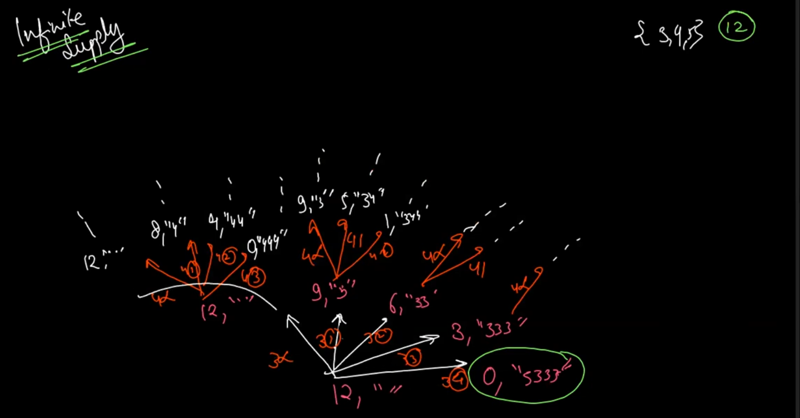

# 2d Combinations - 1 (Box on Level)
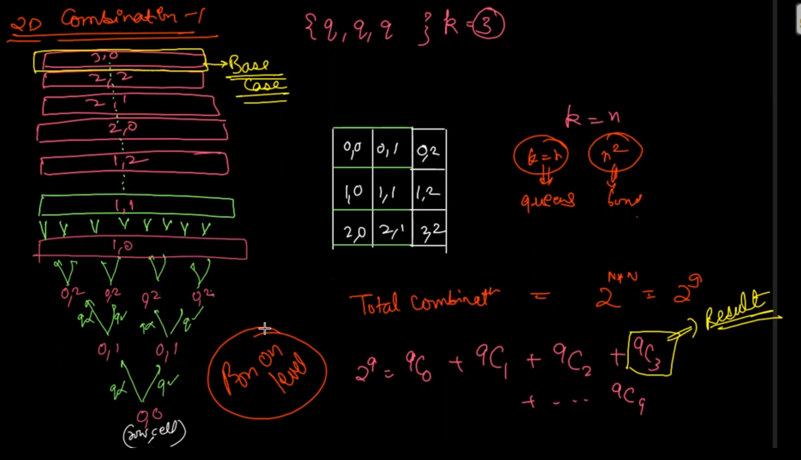

# 2d Combination - 2 using 1d conecpt
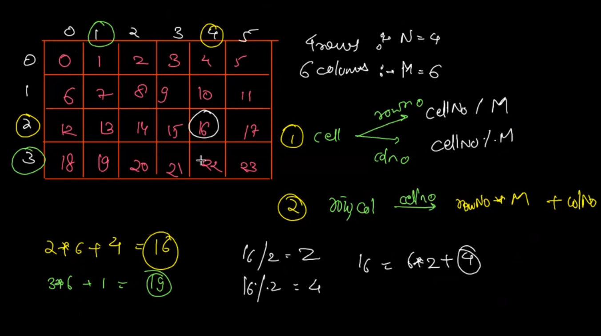

### Corrections and Explanations

1. **Parameters:**
   - `qpsf`: Queens placed so far.
   - `tq`: Total queens (or total cells, since every cell can be occupied by 'q' or '-').
   - `cellNo`: The current cell number being processed.
   - `mat`: The string that stores the current configuration of the board.

2. **Logic:**
   - The base case checks if `cellNo` equals `tq * tq`. This condition checks if we've processed all cells in the board. If `qpsf` equals `tq`, it means we've placed queens in all cells. The code prints the current configuration `mat`.

   - The next `if` statement checks if the current cell is the last in its row using the condition `cellNo % tq == tq - 1`. If true, it means we need to move to the next row. The recursion calls in this block:
     - `queensCombinations(qpsf + 1, tq, cellNo + 1, mat + 'q' + '\n');` places a 'q' and moves to the next cell.
     - `queensCombinations(qpsf, tq, cellNo + 1, mat + '-' + '\n');` places a '-' and moves to the next cell.

   - The `else` block handles the case where we're not at the end of the row:
     - `queensCombinations(qpsf + 1, tq, cellNo + 1, mat + 'q');` places a 'q' without adding a newline.
     - `queensCombinations(qpsf, tq, cellNo + 1, mat + '-');` places a '-' without adding a newline.

3. **Code Snippet:**
   ```java
   import java.io.*;
   import java.util.*;

   public class Main {
       public static void queensCombinations(int qpsf, int tq, int cellNo, String mat) {
           if (cellNo == tq * tq) {
               if (qpsf == tq) {
                   System.out.println(mat);
               }
               return;
           }

           if (cellNo % tq == tq - 1) {
               queensCombinations(qpsf + 1, tq, cellNo + 1, mat + 'q' + '\n'); // yes
               queensCombinations(qpsf, tq, cellNo + 1, mat + '-' + '\n');     // no
           } else {
               queensCombinations(qpsf + 1, tq, cellNo + 1, mat + 'q'); // yes
               queensCombinations(qpsf, tq, cellNo + 1, mat + '-');     // no
           }
       }

       public static void main(String[] args) throws Exception {
           BufferedReader br = new BufferedReader(new InputStreamReader(System.in));
           int n = Integer.parseInt(br.readLine());

           queensCombinations(0, n, 0, "");
       }
   }
   ```

### Notes:
- The code reads `n` as the size of the board and `tq` as the total number of cells on the board (`n * n`).
- This setup allows the generation of all possible configurations of 'q' and '-' on an `n x n` board.
- It seems like the `qpsf` is used more for counting the cells processed rather than tracking the number of queens placed. The board configurations are simply about filling cells with either 'q' or '-'.

The logic behind using a single `cellNo` parameter instead of separate `row` and `column` parameters is to simplify the traversal of the 2D board in a 1D manner. Here's how these conditions work:

### `cellNo` Concept
In a traditional 2D array or matrix traversal, you have two indices: `row` and `column`. However, you can linearize these indices into a single index `cellNo` by considering the 2D grid as a flattened 1D array. This approach helps in iterating over the board cells in a straightforward manner, and it can also simplify recursive function calls.

### `cellNo == tq * tq`
- **Condition:** This checks if all the cells in the `n x n` board have been processed.
- **Explanation:** If `tq` represents the number of rows or columns (i.e., the size of the board), then the total number of cells in the board is `tq * tq` (since the board is `tq` rows by `tq` columns). When `cellNo` reaches this value, it means we have processed all the cells, and the recursion should stop.

### `cellNo % tq == tq - 1`
- **Condition:** This checks if the current `cellNo` corresponds to the last column of a row in the 2D grid.
- **Explanation:** In a flattened 1D view of the board, the last column in any row will have a `cellNo` that, when divided by `tq`, leaves a remainder of `tq - 1`. For example, if `tq` is 4 (for a 4x4 board), then the last column in each row will have `cellNo` values of 3, 7, 11, 15 (i.e., `tq - 1`, `2*tq - 1`, `3*tq - 1`, etc.). The condition `cellNo % tq == tq - 1` captures these cases, indicating that the next recursive call should start a new line (row) in the `mat` string representation of the board.

### Advantages of This Approach
1. **Simplicity:** Using a single `cellNo` reduces the number of parameters and makes the recursive calls simpler.
2. **Clarity:** It avoids the need for manual row and column calculations or increments, as the traversal is handled uniformly by incrementing `cellNo`.
3. **Generalization:** This method is easily adaptable to other grid-based problems where the grid can be flattened into a 1D array.

In summary, this approach linearizes the board traversal, making the implementation more straightforward and avoiding the complexity of managing two separate indices (`row` and `column`). The specific conditions (`cellNo == tq * tq` and `cellNo % tq == tq - 1`) are used to manage the end-of-board and end-of-row scenarios, respectively.


# 2d combinations queen as level (Item as level)
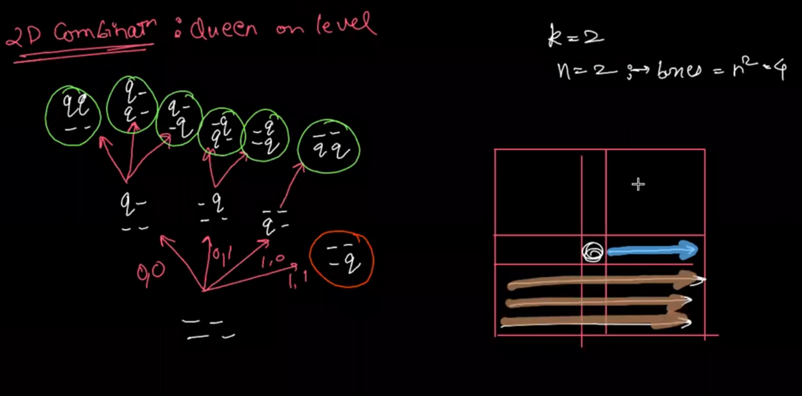

### Concept: "Queen as Level" or "Item as Level"

In this approach, each recursive level corresponds to placing a specific queen (or item). The goal is to place the `qpsf`-th queen on the board, exploring all possible positions for this queen before moving to the next.

### How the Code Implements This Concept

1. **Function Parameters**:
   - `qpsf` (`Queens Placed So Far`): Indicates the current queen being placed.
   - `tq` (`Total Queens`): Total number of queens to place, equal to the size of the board (`n`).
   - `chess`: The chessboard as a 2D array.
   - `lastQueenRow` and `lastQueenCol`: The last placed queen's position. These help to ensure the next queen is not placed before the last one, maintaining an order.

2. **Base Case**:
   - When `qpsf == tq`, all queens have been placed. The board configuration is printed.

3. **Recursive Case**:
   - The function tries to place the current queen (`qpsf`) in all possible positions starting from `lastQueenRow` and `lastQueenCol + 1` in the same row, and then from the next rows.
   - **Same Row Placement**: It starts placing the current queen from `lastQueenCol + 1` in the same row (`lastQueenRow`), ensuring it does not place another queen in the same position or before it in the row.
   - **Next Rows Placement**: After exploring the current row, it moves to the next row (`lastQueenRow + 1`) and iterates through all columns from the beginning (`j = 0`).

4. **Backtracking**:
   - After placing a queen and making the recursive call, the function removes the queen (`chess[i][j] = '-'`) to explore other possible placements.

### Key Advantages of "Queen as Level" Approach

1. **Simplicity**: By treating each queen as a level, the code naturally ensures that each queen is placed exactly once and in a specific order. This reduces the complexity of ensuring all queens are placed.
2. **Ease of Backtracking**: When you backtrack, you only need to undo the placement of the current queen without worrying about other placements.

### Example Walkthrough

For a 2x2 board (`n = 2`), the recursive calls would explore all possible ways to place two queens:

1. **First Queen**:
   - Attempt to place in `(0,0)`, then `(0,1)`.
   - Then move to `(1,0)`, and finally `(1,1)`.

2. **Second Queen**:
   - After placing the first queen, the second queen is placed in all remaining positions, respecting the order determined by `lastQueenRow` and `lastQueenCol`.

The result is that all possible combinations of queen placements are explored, and the function prints each configuration.

This "queen as level" approach is a good technique for problems where you want to explore combinations or placements of distinct items (like queens, knights, or even other types of items) on a grid or board. It ensures that each item is considered individually and placed in all possible valid positions.

Here's your code with detailed comments explaining the logic and steps:

```java
import java.io.BufferedReader;
import java.io.InputStreamReader;

public class _50_2D_Combiantion_QOL_Item_as_level {

    // This method generates all combinations of placing tq queens on an n x n board
    public static void queensCombinations(int qpsf, int tq, Character[][] chess, int lastQueenRow, int lastQueenCol) {
        // Base case: if the number of queens placed so far equals the total number of queens
        if (qpsf == tq) {
            // Print the current configuration of the chess board
            for (int i = 0; i < tq; i++) {
                for (int j = 0; j < tq; j++) {
                    System.out.print(chess[i][j] + "\t");
                }
                System.out.println();
            }
            System.out.println();
            return;
        }

        // Try to place the current queen in the remaining cells of the current row
        for (int j = lastQueenCol + 1; j < tq; j++) {
            if (chess[lastQueenRow][j] == '-') { // Check if the cell is empty
                chess[lastQueenRow][j] = 'q'; // Place the queen
                // Recur to place the next queen
                queensCombinations(qpsf + 1, tq, chess, lastQueenRow, j);
                chess[lastQueenRow][j] = '-'; // Backtrack: remove the queen
            }
        }

        // Try to place the current queen in the cells of the subsequent rows
        for (int i = lastQueenRow + 1; i < tq; i++) {
            for (int j = 0; j < tq; j++) {
                if (chess[i][j] == '-') { // Check if the cell is empty
                    chess[i][j] = 'q'; // Place the queen
                    // Recur to place the next queen
                    queensCombinations(qpsf + 1, tq, chess, i, j);
                    chess[i][j] = '-'; // Backtrack: remove the queen
                }
            }
        }
    }

    public static void main(String[] args) throws Exception {
        BufferedReader br = new BufferedReader(new InputStreamReader(System.in));
        int n = Integer.parseInt(br.readLine()); // Read the board size (n)
        Character[][] chess = new Character[n][n]; // Initialize the chess board
        for (int i = 0; i < n; i++) {
            for (int j = 0; j < n; j++) {
                chess[i][j] = '-'; // Set all cells to empty
            }
        }

        // Start the recursion with no queens placed, on an empty board
        queensCombinations(0, n, chess, 0, -1);
    }
}
```

### Key Points Highlighted in Comments:

1. **Base Case**: The base case checks if the number of queens placed so far (`qpsf`) is equal to the total number of queens (`tq`). If true, it means a valid configuration is found, and the board is printed.

2. **Placing Queens in the Current Row**:
   - The first for-loop attempts to place a queen in the same row as the last placed queen (`lastQueenRow`), starting from the column immediately after `lastQueenCol`.
   - This ensures queens are placed in a non-overlapping manner in the current row.

3. **Placing Queens in Subsequent Rows**:
   - The second set of nested loops attempts to place the next queen in the rows below the last placed queen (`lastQueenRow + 1`), starting from the first column (`j = 0`).
   - This loop covers all possible placements of the current queen in the rows below the last placed queen.

4. **Backtracking**:
   - After placing a queen and making a recursive call to place the next queen, the code removes the queen (`chess[lastQueenRow][lastQueenCol] = '-'`) to explore other configurations. This is known as backtracking.

5. **Initialization and Input**:
   - The `main` method initializes the chessboard with `'-'` (indicating empty cells) and reads the board size `n` from the input. It then starts the recursive process by calling `queensCombinations`.

This code effectively demonstrates how to use recursion and backtracking to explore all possible configurations of placing queens on an `n x n` board, treating each queen as a level in the recursive exploration.

# 2D_Combiantion as 1D Item as Level or Queen as Level

Here's your provided code with added comments to explain the logic and steps, and I've made necessary corrections to ensure the code compiles and functions correctly:

```java
import java.io.BufferedReader;
import java.io.InputStreamReader;

public class Main {

    // Method to generate all combinations of placing tq queens on an n x n chessboard
    public static void queensCombinations(int qpsf, int tq, Character[][] chess, int lastCellNo) {
        // Base case: when the number of queens placed so far equals the total number of queens
        if (qpsf == tq) {
            // Print the current configuration of the chessboard
            for (int i = 0; i < tq; i++) {
                for (int j = 0; j < tq; j++) {
                    System.out.print(chess[i][j] + "\t");
                }
                System.out.println();
            }
            System.out.println();
            return;
        }

        // Try to place the current queen in the remaining cells after lastCellNo
        for (int c = lastCellNo + 1; c < tq * tq; c++) {
            int rowNo = c / tq;  // Calculate the row number
            int colNo = c % tq;  // Calculate the column number
            chess[rowNo][colNo] = 'q';  // Place the queen at the calculated position
            // Recur to place the next queen
            queensCombinations(qpsf + 1, tq, chess, c);
            chess[rowNo][colNo] = '-';  // Backtrack: remove the queen
        }
    }

    public static void main(String[] args) throws Exception {
        BufferedReader br = new BufferedReader(new InputStreamReader(System.in));
        int n = Integer.parseInt(br.readLine());  // Read the board size (n)
        Character[][] chess = new Character[n][n];  // Initialize the chessboard
        for (int i = 0; i < n; i++) {
            for (int j = 0; j < n; j++) {
                chess[i][j] = '-';  // Set all cells to empty
            }
        }

        // Start the recursion with no queens placed, starting from cell number -1
        queensCombinations(0, n, chess, -1);
    }
}
```

### Explanation of Key Points in the Code:

1. **Base Case (Line 8)**:
   - If `qpsf` (Queens Placed So Far) equals `tq` (Total Queens), it indicates that all queens have been placed. The function prints the current configuration of the chessboard.

2. **Main Loop for Placement (Line 19)**:
   - The loop iterates over all possible cell numbers starting from `lastCellNo + 1` up to `tq * tq` (which represents the total number of cells on the board). The variable `c` represents the linearized cell number.

3. **Row and Column Calculation (Lines 20-21)**:
   - `rowNo` and `colNo` are calculated using the linearized cell number `c`. This ensures that the cells are traversed in row-major order.
   - `rowNo = c / tq` calculates the row index by integer division.
   - `colNo = c % tq` calculates the column index using the modulus operator.

4. **Queen Placement and Backtracking (Lines 22-26)**:
   - The queen is placed at the position `(rowNo, colNo)`.
   - The function then recursively calls `queensCombinations` with `qpsf + 1` and the current cell number `c`.
   - After returning from the recursion, the code backtracks by removing the queen from `(rowNo, colNo)`.

5. **Initialization and Input (Lines 29-35)**:
   - The `main` method initializes the chessboard and sets all cells to `'-'` to indicate they are empty.
   - The initial call to `queensCombinations` starts with no queens placed (`qpsf = 0`) and begins the search from an invalid cell number (`-1`), ensuring the first queen is placed in cell `0`.

This approach, using `lastCellNo` and linearized cell numbers, is an efficient way to ensure that queens are placed without revisiting previously considered positions and allows for straightforward backtracking. This method is especially useful in scenarios where the board or grid is large, and a more structured approach is needed to systematically explore all combinations.

# 2d Queen Permutation Box on Level
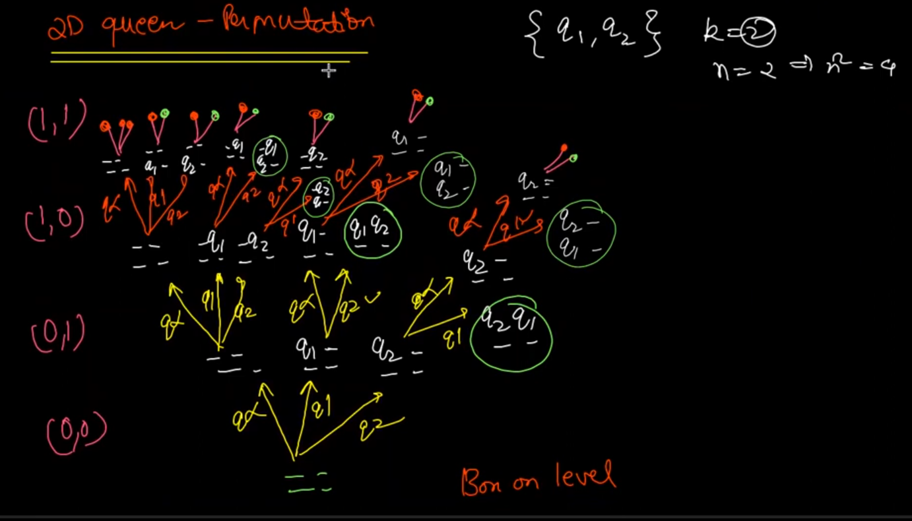

# 2d Queen Permutation Item on Level / Queen on Level
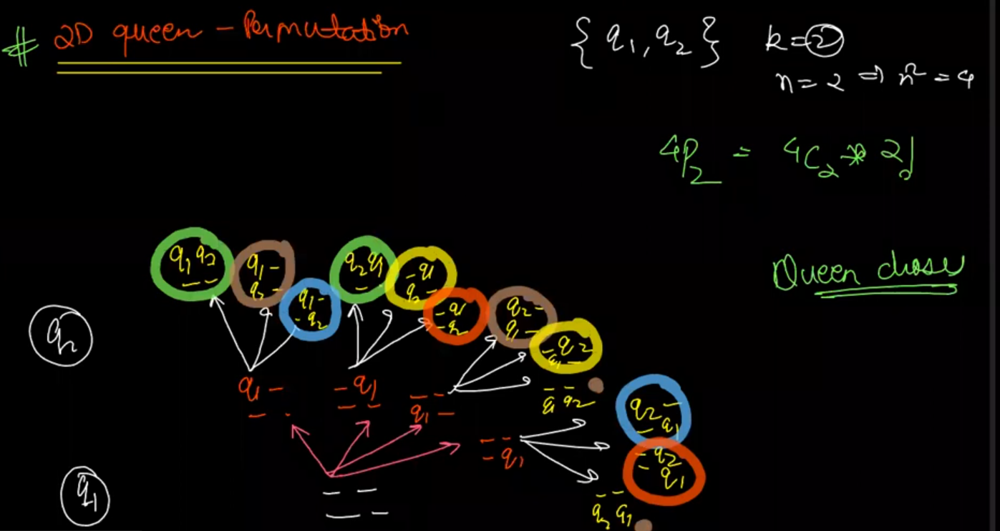

# 2D Permutation as 1D Box on level


```java
import java.io.BufferedReader;
import java.io.InputStreamReader;

public class Main {
    // Method to generate permutations of placing queens on an n x n chessboard
    public static void queensPermutations(int qpsf, int tq, int cellNo, String mat, boolean[] vis) {
        // Base case: if all cells are processed
        if (cellNo == tq * tq) {
            // Check if the number of queens placed matches the total queens needed
            if (qpsf == tq) {
                // Print the current permutation of the board
                System.out.println(mat);
                System.out.println();
            }
            return;
        }

        // If we're at the last cell of the current row
        if (cellNo % tq == tq - 1) {
            // Iterate through all possible queens to place in this row
            for (int i = 0; i < tq; i++) {
                if (!vis[i]) { // If this queen hasn't been placed yet
                    vis[i] = true; // Mark the queen as placed
                    // Place the queen and move to the next row (newline after the queen)
                    queensPermutations(qpsf + 1, tq, cellNo + 1, mat + "q" + (i + 1) + "\t\n", vis);
                    vis[i] = false; // Backtrack: unmark the queen as placed
                }
            }
            // Place an empty cell at the end of the row and move to the next row
            queensPermutations(qpsf, tq, cellNo + 1, mat + "-\t\n", vis);
        } else {
            // Iterate through all possible queens to place in this cell
            for (int i = 0; i < tq; i++) {
                if (!vis[i]) { // If this queen hasn't been placed yet
                    vis[i] = true; // Mark the queen as placed
                    // Place the queen and continue in the same row
                    queensPermutations(qpsf + 1, tq, cellNo + 1, mat + "q" + (i + 1) + "\t", vis);
                    vis[i] = false; // Backtrack: unmark the queen as placed
                }
            }
            // Place an empty cell and continue in the same row
            queensPermutations(qpsf, tq, cellNo + 1, mat + "-\t", vis);
        }
    }

    public static void main(String[] args) throws Exception {
        BufferedReader br = new BufferedReader(new InputStreamReader(System.in));
        int n = Integer.parseInt(br.readLine()); // Read the number of queens (n) from input
        boolean[] queens = new boolean[n]; // Boolean array to track if each queen has been placed
        // Start generating permutations with 0 queens placed, n queens total, starting from cell 0, and an empty board state
        queensPermutations(0, n, 0, "", queens);
    }
}
```

### Detailed Explanation:

1. **Main Class and Method**:
   - `BufferedReader br = new BufferedReader(new InputStreamReader(System.in));`: Reads the number of queens (`n`) from standard input.
   - `boolean[] queens = new boolean[n];`: Initializes a boolean array `queens` to track whether each queen (1 through `n`) has been placed on the board.

2. **queensPermutations Method**:
   - **Parameters**:
     - `qpsf` (Queens Placed So Far): Counts the number of queens currently placed on the board.
     - `tq` (Total Queens): The total number of queens to place.
     - `cellNo`: The current cell number being processed (0-indexed).
     - `mat`: A string representing the current state of the board layout.
     - `vis` (Visited): A boolean array tracking whether a particular queen has been placed on the board.

   - **Base Case**: `if (cellNo == tq * tq)`: When all cells have been processed, the method checks if the number of placed queens matches the total queens (`qpsf == tq`). If true, it prints the current board configuration.

   - **Row End Case**:
     - `if (cellNo % tq == tq - 1)`: This condition checks if the current cell is the last cell in the row.
     - The inner loop iterates over all queens to find a place for each unplaced queen in the current row. If a queen is placed, the method recursively processes the next cell and row.
     - After attempting to place a queen, the method marks the cell as empty (`"-\t\n"`) and moves to the next row.

   - **General Case**:
     - For cells that are not at the end of a row, the process is similar, but without adding a newline after placing a queen or leaving the cell empty.

This recursive approach generates all possible permutations of placing `n` queens on an `n x n` chessboard, ensuring that each queen is placed only once per permutation.

# Subsets II (unique subsets) Item on Level
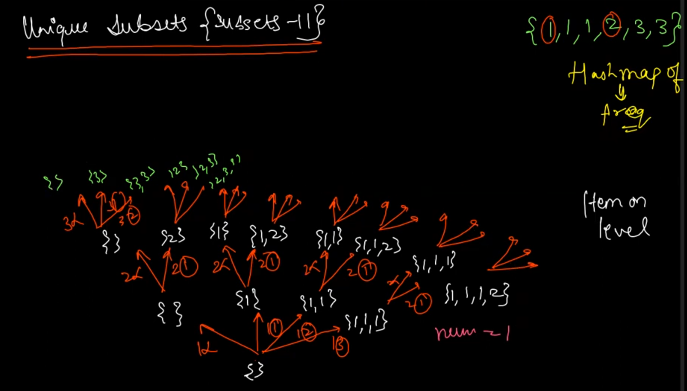

Here's the code with detailed comments explaining the logic:

```java
import java.util.ArrayList;
import java.util.HashMap;
import java.util.List;

public class SubsetFinder {
    // List to store all unique subsets
    private List<List<Integer>> ans = new ArrayList<>();

    // Recursive function to generate subsets
    public void subsets(int currentItem, ArrayList<Integer> unique,
                        HashMap<Integer, Integer> freq, List<Integer> res) {
        // Base case: if we have processed all unique items, add the current subset to the result list
        if (currentItem == unique.size()) {
            ans.add(new ArrayList<>(res));
            return;
        }

        // Get the current unique value
        int val = unique.get(currentItem);

        // Case 1: Do not include the current item in the subset
        subsets(currentItem + 1, unique, freq, res); 

        // Case 2: Include the current item `f` times in the subset, where 0 <= f < freq[val]
        for (int f = 0; f < freq.get(val); f++) {
            res.add(val); // Add the current item to the subset
            subsets(currentItem + 1, unique, freq, res); // Recursive call with next item
        }

        // Backtrack: remove the added items from the subset before returning
        for (int f = 0; f < freq.get(val); f++) {
            res.remove(res.size() - 1);
        }
    }

    // Main function to initialize the unique list and frequency map, and start the subset generation
    public List<List<Integer>> subsetsWithDup(int[] nums) {
        ArrayList<Integer> unique = new ArrayList<>();
        HashMap<Integer, Integer> freq = new HashMap<>();

        // Count frequency of each element and collect unique elements
        for (int val : nums) {
            if (freq.containsKey(val)) {
                freq.put(val, freq.get(val) + 1); // Increment frequency if already in map
            } else {
                freq.put(val, 1); // Initialize frequency to 1 for a new element
                unique.add(val); // Add to unique elements list
            }
        }

        // Start generating subsets from the 0th index
        subsets(0, unique, freq, new ArrayList<>());
        return ans; // Return the list of unique subsets
    }

    public static void main(String[] args) {
        SubsetFinder sf = new SubsetFinder();
        int[] nums = {1, 2, 2};
        List<List<Integer>> result = sf.subsetsWithDup(nums);
        System.out.println(result); // Print the result
    }
}
```

### Explanation:
1. **Class and Fields**:
   - `SubsetFinder` class contains the methods and fields required for finding subsets.
   - `ans`: A list of lists to store all the unique subsets.

2. **`subsets` Method**:
   - A recursive method to generate subsets by considering each unique item and deciding whether to include it in the subset or not.
   - **Base Case**: When `currentItem` reaches the size of the unique list, the current subset (`res`) is added to `ans`.
   - **Recursive Calls**:
     - First, it considers the case where the current item is not included in the subset.
     - Then, it includes the current item `f` times (where `f` is from 0 to the frequency of the current item) and recursively generates subsets with the next unique item.
   - **Backtracking**: After processing, it removes the added items from the subset to explore other possibilities.

3. **`subsetsWithDup` Method**:
   - Initializes the unique elements list and their frequencies.
   - Iterates through the input array `nums`, populating the `freq` map with the frequency of each element and the `unique` list with distinct elements.
   - Calls the `subsets` method to start the subset generation process.

4. **`main` Method**:
   - Demonstrates the usage of the `SubsetFinder` class by creating an instance, calling the `subsetsWithDup` method, and printing the result.

This code is designed to handle duplicates by counting the frequency of each unique element and controlling the number of times each element is included in the subsets.


# Subsets II (unique subsets) Box on Level
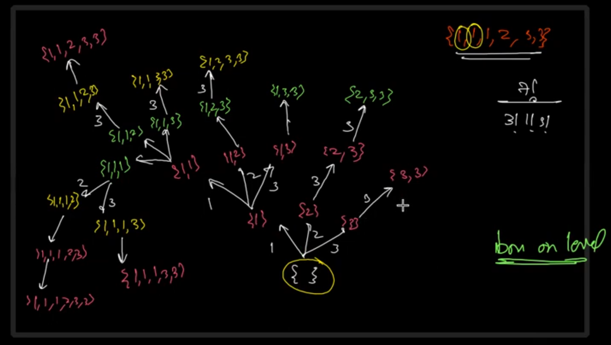

we are using a "box on level" approach to generate unique subsets, where you consider each unique item and decide how many times to include it in the current subset. Here’s the corrected and complete code with explanations:

```java
import java.util.ArrayList;
import java.util.HashMap;
import java.util.List;

public class Solution {

    List<List<Integer>> ans = new ArrayList<>();

    // Recursive method to generate subsets
    public void subsets(int lastItem, ArrayList<Integer> unique, HashMap<Integer, Integer> freq, List<Integer> res) {
        // Add the current subset to the list of answers
        ans.add(new ArrayList<>(res));

        // Iterate over the unique items starting from lastItem
        for (int i = lastItem; i < unique.size(); i++) {
            int val = unique.get(i);
            int oldFreq = freq.get(val); // Get the frequency of the current item

            // Only proceed if the item can still be added to the subset
            if (oldFreq > 0) {
                freq.put(val, oldFreq - 1); // Decrease the frequency of the current item
                res.add(val); // Add the current item to the subset

                // Recurse with the updated parameters
                subsets(i, unique, freq, res);

                // Backtrack: remove the last item and restore its frequency
                res.remove(res.size() - 1);
                freq.put(val, oldFreq);
            }
        }
    }

    // Method to initialize data structures and start the recursion
    public List<List<Integer>> subsetsWithDup(int[] nums) {
        ArrayList<Integer> unique = new ArrayList<>();
        HashMap<Integer, Integer> freq = new HashMap<>();

        // Count frequency of each element and collect unique elements
        for (int val : nums) {
            if (freq.containsKey(val)) {
                freq.put(val, freq.get(val) + 1); // Increment frequency if already present
            } else {
                freq.put(val, 1); // Initialize frequency to 1 for a new element
                unique.add(val); // Add to the unique list
            }
        }

        // Start the recursion with initial parameters
        subsets(0, unique, freq, new ArrayList<>());
        return ans;
    }

    public static void main(String[] args) {
        Solution solution = new Solution();
        int[] nums = {1, 2, 2};
        List<List<Integer>> result = solution.subsetsWithDup(nums);
        System.out.println(result); // Print the result
    }
}
```

### Explanation:
1. **Class and Fields**:
   - The `Solution` class contains the main methods and fields for generating subsets.
   - `ans`: A list to store all the unique subsets generated.

2. **`subsets` Method**:
   - This is a recursive method that generates subsets by considering each unique item and its frequency.
   - **Base Case**: Each recursive call adds the current subset (`res`) to `ans`.
   - **Iteration and Recursive Calls**: It iterates over the unique items starting from `lastItem` and tries to include each item in the subset. The frequency is decreased when an item is added, and the `subsets` method is called recursively with the updated list.
   - **Backtracking**: After each recursive call, the last added item is removed from `res`, and its frequency is restored in `freq`.

3. **`subsetsWithDup` Method**:
   - Initializes the `unique` list and `freq` map.
   - Iterates through the input array `nums` to populate `freq` with the frequency of each element and `unique` with distinct elements.
   - Calls the `subsets` method to generate the subsets starting from the first unique item.

4. **`main` Method**:
   - Demonstrates the usage of the `Solution` class by creating an instance, calling the `subsetsWithDup` method, and printing the result.

This implementation effectively handles duplicates by tracking the frequency of each unique element and ensuring each subset is generated only once.

<br/>
<br/>
<br/>

# Rat in Maze 
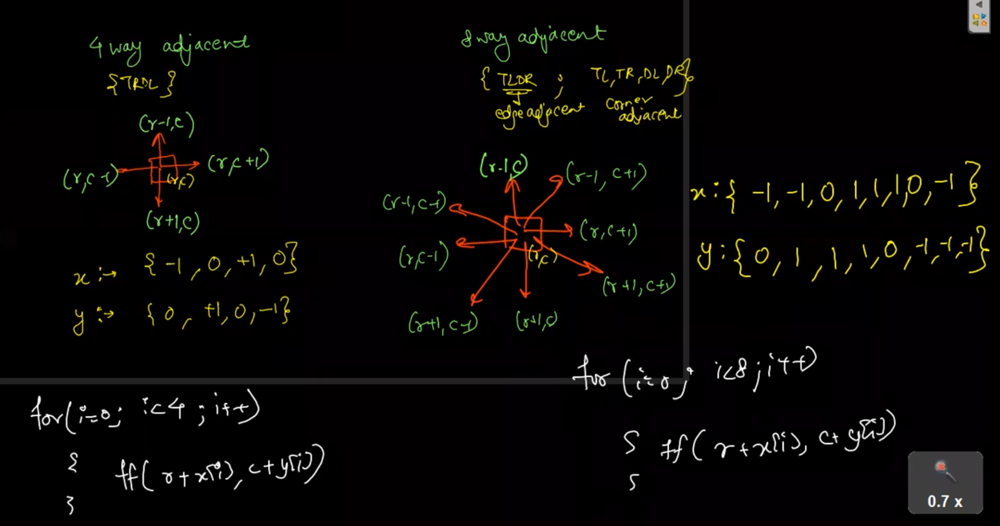
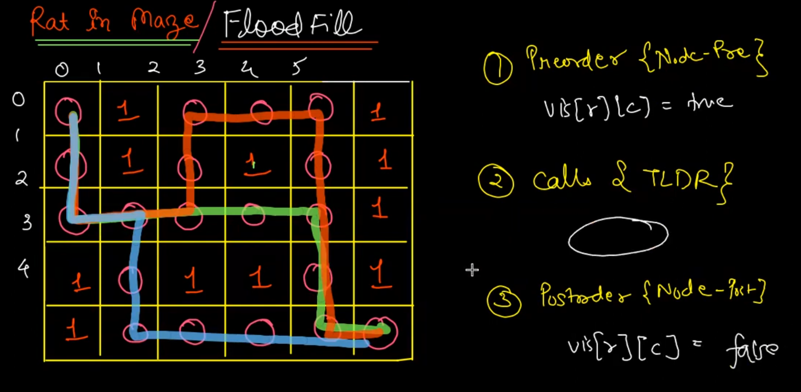

```java
import java.util.ArrayList;

public class Solution {

    // Method to perform flood fill and find all paths from top-left to bottom-right
    public static void floodfill(int[][] maze, int sr, int sc, int[] x, int[] y, char[] ch, String asf, boolean[][] vis, ArrayList<String> ans) {
        int dr = maze.length - 1;  // Destination row index
        int dc = maze[0].length - 1;  // Destination column index

        // Base case: if out of bounds, cell is blocked, or already visited
        if (sr > dr || sc > dc || sr < 0 || sc < 0 || maze[sr][sc] == 0 || vis[sr][sc] == true) {
            return; // Terminate this path
        }

        // Base case: reached the destination
        if (sr == dr && sc == dc) {
            ans.add(asf); // Add the path to the list of answers
            return;
        }

        vis[sr][sc] = true; // Mark the current cell as visited

        // Iterate over the possible moves
        for (int i = 0; i < x.length; i++) {
            // Recursive call for each direction
            floodfill(maze, sr + x[i], sc + y[i], x, y, ch, asf + ch[i], vis, ans);
        }

        vis[sr][sc] = false; // Backtrack and unmark the current cell
    }

    // Method to initiate flood fill and find all paths
    public ArrayList<String> findPath(int[][] mat) {
        int n = mat.length; // Number of rows
        int m = mat[0].length; // Number of columns
        boolean[][] vis = new boolean[n][m]; // Visited array
        int[] x = new int[]{-1, 0, 1, 0}; // Row direction offsets for U, L, D, R
        int[] y = new int[]{0, -1, 0, 1}; // Column direction offsets for U, L, D, R
        char[] ch = new char[]{'U', 'L', 'D', 'R'}; // Directions corresponding to the offsets
        ArrayList<String> ans = new ArrayList<String>(); // List to store the paths

        // Start flood fill from the top-left corner
        floodfill(mat, 0, 0, x, y, ch, "", vis, ans);

        return ans; // Return the list of paths
    }

    public static void main(String[] args) {
        // Example usage
        int[][] mat = {
            {1, 0, 0, 0},
            {1, 1, 0, 1},
            {0, 1, 0, 0},
            {1, 1, 1, 1}
        };

        Solution sol = new Solution();
        ArrayList<String> paths = sol.findPath(mat);
        System.out.println(paths);
    }
}
```

### Detailed Explanation:

1. **Flood Fill Method (`floodfill`)**:
   - **Parameters**:
     - `int[][] maze`: The 2D array representing the maze, where `1` indicates a traversable cell and `0` indicates a blocked cell.
     - `int sr, sc`: The current position in the maze (starting row and column).
     - `int[] x, y`: Arrays that define the row and column offsets for the possible moves (up, left, down, right).
     - `char[] ch`: Array representing the direction characters corresponding to the moves (`U` for up, `L` for left, `D` for down, `R` for right).
     - `String asf`: The accumulated path string so far.
     - `boolean[][] vis`: A 2D boolean array to keep track of visited cells.
     - `ArrayList<String> ans`: List to store all valid paths from the top-left to bottom-right of the maze.
   - **Base Cases**:
     - If the current position is out of bounds, a blocked cell, or already visited, the method returns without proceeding further.
     - If the current position is the destination cell (bottom-right corner), the current path (`asf`) is added to the `ans` list.
   - **Recursive Calls**:
     - For each possible direction (up, left, down, right), the method recursively calls itself to explore the next cell.
     - The `asf` string is updated with the corresponding direction character.

2. **Find Path Method (`findPath`)**:
   - Initializes necessary variables and arrays for directions and visited cells.
   - Calls the `floodfill` method starting from the top-left corner (0,0).
   - Returns the list of paths found.

3. **Main Method**:
   - Provides an example maze and demonstrates how to use the `findPath` method to find all paths from the top-left to the bottom-right of the maze. The paths are printed to the console.

This implementation uses a backtracking approach to explore all possible paths from the start to the destination while avoiding blocked or visited cells.

# Path with maximum gold

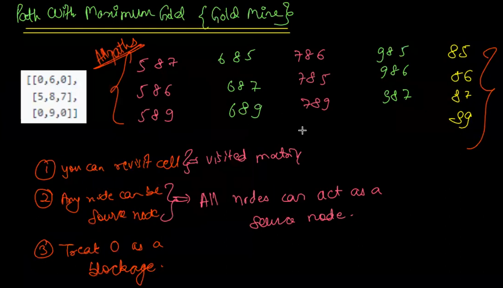

# Keypad combinations


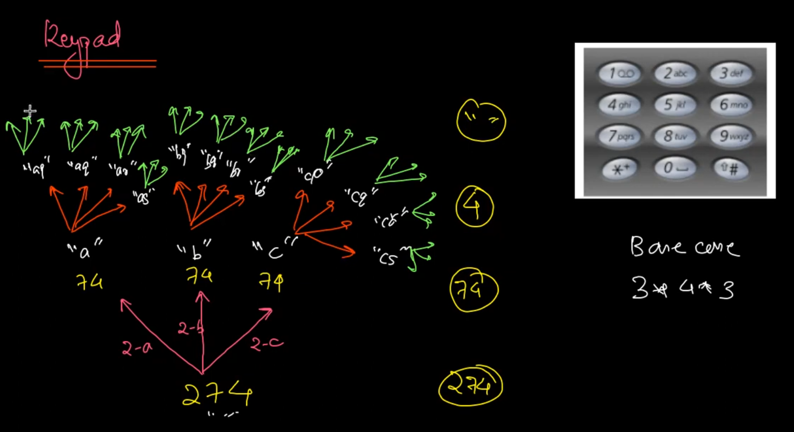


# Generate Abbrevations

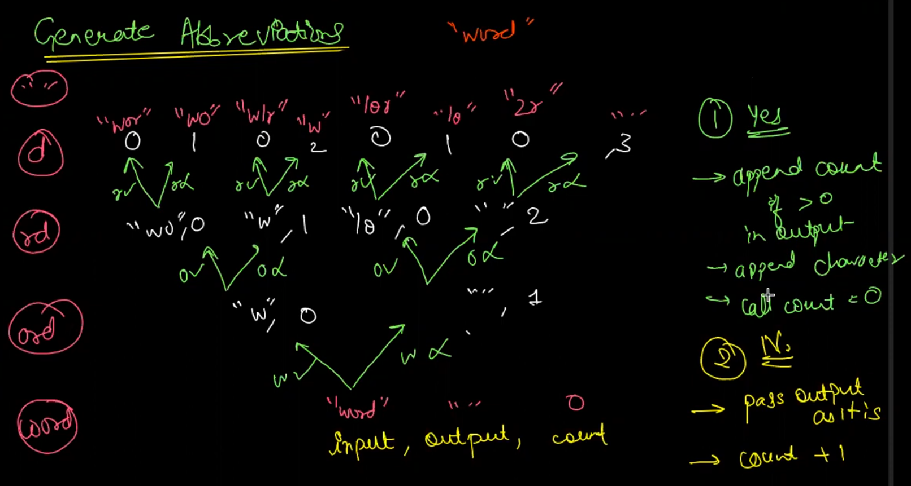

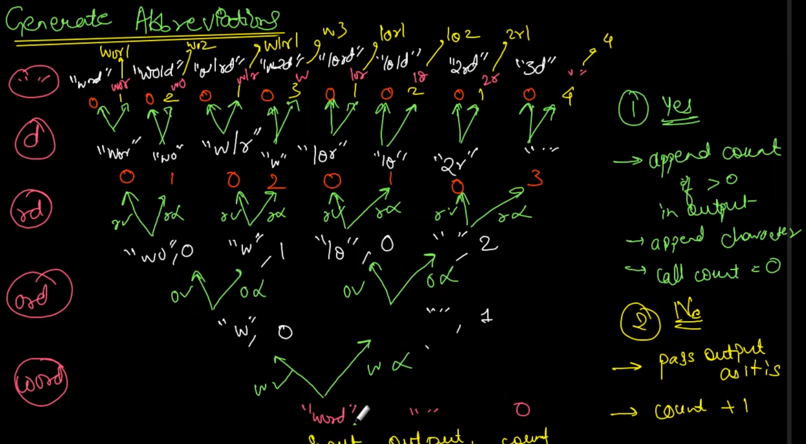

```java
import java.util.Scanner;

public class _56_Generate_Abbrevations {
    public static void solution(String str, String asf, int count) {
        // write your code here
        if (str.length() == 0) {
            if (count > 0) {

                System.out.println(asf + count);
            } else {
                System.out.println(asf);
            }

            return;
        }

        //yes
        solution(str.substring(1), count > 0 ? asf + count + str.charAt(0) : asf + str.charAt(0), 0);

        //No
        solution(str.substring(1), asf, ++count);

    }

    public static void main(String[] args) {
        Scanner scn = new Scanner(System.in);
        String str = scn.nextLine();
        solution(str, "", 0);
    }
}

```

This Java program generates all possible abbreviations of a given string. The idea is to either abbreviate a character or not while traversing the string, and the function `solution()` implements this using recursion.

Let's break it down:

### Code Explanation:

1. **Base Case:**
   ```java
   if (str.length() == 0) {
       if (count > 0) {
           System.out.println(asf + count);
       } else {
           System.out.println(asf);
       }
       return;
   }
   ```
   - If the string is empty (i.e., `str.length() == 0`), the base case is reached.
   - If `count > 0`, it means that there are consecutive characters that were abbreviated, so the count is added to the result string (`asf`).
   - Otherwise, the accumulated string (`asf`) is printed without adding any count.

2. **Recursion:**
   The two recursive calls represent two decisions:
   
   - **Yes Decision**: Abbreviate the current character.
     ```java
     solution(str.substring(1), count > 0 ? asf + count + str.charAt(0) : asf + str.charAt(0), 0);
     ```
     - In this case, if there is an ongoing abbreviation (`count > 0`), it appends the count and the current character to the `asf` string.
     - It resets the count to `0` since the character is explicitly kept.

   - **No Decision**: Continue abbreviating by increasing the `count`.
     ```java
     solution(str.substring(1), asf, ++count);
     ```
     - The character is skipped and the abbreviation count (`count`) is incremented.

### Example Input/Output:

For input `"abc"`:

- The recursive function explores both abbreviating and not abbreviating each character, resulting in the following outputs:

```
3
2c
1b1
1bc
a2
a1c
ab1
abc
```

### How It Works:
- The first case `3` represents the abbreviation of the entire string.
- `2c` means the first two characters are abbreviated, and the last character is kept.
- `1b1` means the first character is abbreviated, the second is kept, and the third is abbreviated.
- And so on, until the full string `abc` is printed without abbreviation.

### Input/Output Example:
```
Input: 
abc

Output:
3
2c
1b1
1bc
a2
a1c
ab1
abc
``` 

This solution explores all possible ways of generating abbreviations by selectively including or skipping each character of the input string.

# N Queen - Combination
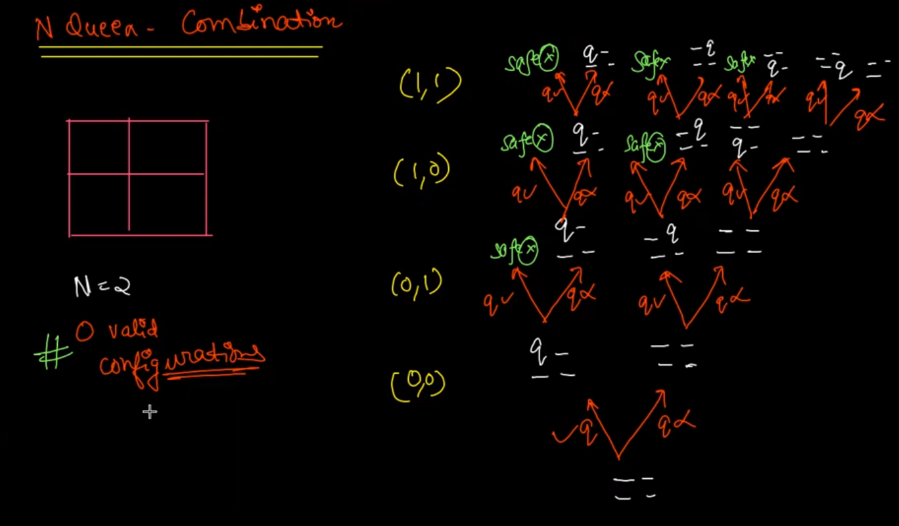

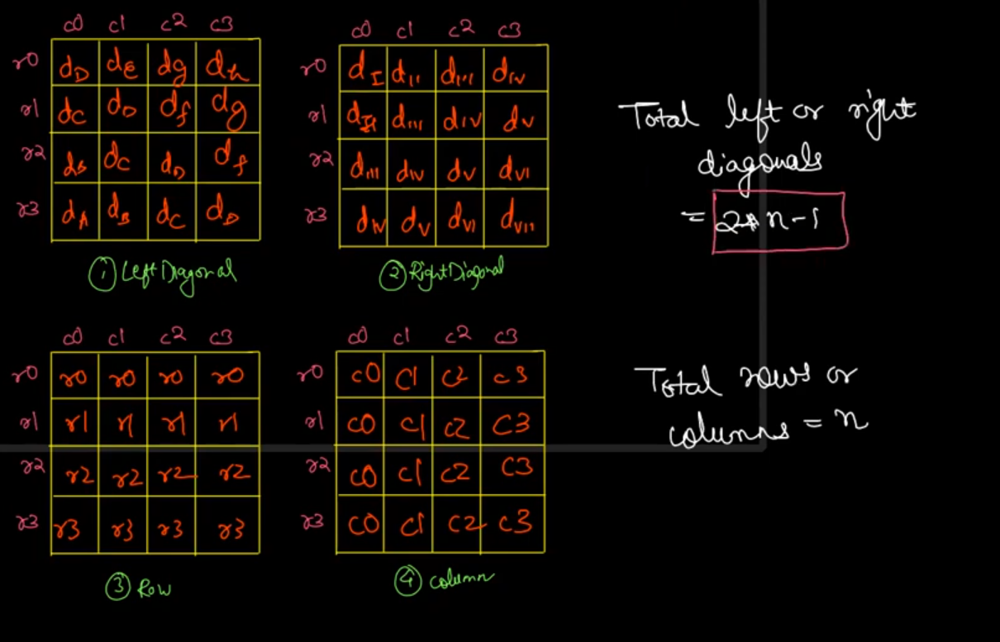

```java
class Solution {
        static List<List<String>> res;

    public static boolean isQueenSafe(int row,int col,boolean[][]chess){

        //row(left)
        for(int j=0;j<col;j++){
            if(chess[row][j]==true){
                return false;
            }
        }

         // upward column
         for(int i=0;i<row;i++){
            if(chess[i][col]==true){
                return false;
            }
        }

        // upward left Diagonal 
        int i=row,j=col;
        while(i>=0 && j>=0){
            if(chess[i][j]==true){
                return false;
            }

            i--; j--;
        }

        // Upward Right Diagonal
        i=row;
        j=col;

        while(i>=0 && j<chess[0].length){
            if(chess[i][j]==true){
                return false;
            }
            i--; j++;
        }


        return true;
    }

    public static void nqueen(int r,int c,int qpsf,boolean[][] vis){
        if(qpsf==vis.length){
            List<String> ans=new ArrayList<>();
            for(int i=0;i<vis.length;i++){
                String curr="";
                for(int j=0;j<vis.length;j++){
                    if(vis[i][j] == true){
                        curr = curr + "Q";
                    }else{
                        curr = curr+".";
                    }
                }
                ans.add(curr);
            }
            res.add(ans);
            return;
        }

        if(r==vis.length){
            return;
        }

        if(isQueenSafe(r, c, vis)){
            vis[r][c] = true;

            if(c==vis.length-1){
                nqueen(r+1, 0, qpsf+1, vis);
            }else{
                nqueen(r, c+1, qpsf+1, vis);

            }

            vis[r][c] = false;
        }
        if(c==vis.length-1){
            nqueen(r+1, 0, qpsf, vis);
        }else{
            nqueen(r, c+1, qpsf, vis);

        }


    }

    public List<List<String>> solveNQueens(int n) {
        res = new ArrayList<>();
        boolean[][] vis = new boolean[n][n];

        nqueen(0,0,0,vis);
        return res;
    }
}
```

This implementation aims to solve the N-Queens problem, where the objective is to place N queens on an N x N chessboard such that no two queens threaten each other. The provided class uses recursion and backtracking to explore possible placements of queens and returns all valid solutions.

Here’s a breakdown of how the code works:

### 1. **`isQueenSafe` Function**:
   - This function checks whether placing a queen at the given row (`row`) and column (`col`) is safe.
   - It ensures that no other queens are present:
     - In the same row to the left of the current column.
     - In the same column above the current row.
     - In the upper left diagonal.
     - In the upper right diagonal.
   - If any of these conditions are violated, it returns `false`, indicating the position is not safe.

### 2. **`nqueen` Function**:
   - The core recursive backtracking function that attempts to place queens on the board.
   - Parameters:
     - `r` and `c`: represent the current row and column.
     - `qpsf`: stands for "Queens placed so far" and tracks how many queens have been placed.
     - `vis`: a 2D boolean array representing the chessboard, where `true` indicates a queen's position.
   - **Base Case**:
     - If `qpsf` equals `n` (i.e., N queens have been placed), it means a valid configuration has been found. The current configuration is then added to the result (`res`).
   - **Recursive Case**:
     - It checks if placing a queen at the current row and column is safe.
     - If safe, it places a queen (`vis[r][c] = true`), then moves on to the next row (or column) depending on the current position.
     - If not safe, or after exploring the recursive path, it backtracks by removing the queen (`vis[r][c] = false`) and explores other options.

### 3. **`solveNQueens` Function**:
   - This function initializes the `vis` board and calls the `nqueen` recursive function to start the process from row 0 and column 0 with 0 queens placed.
   - After all valid solutions are found, it returns the result list `res`.

### Code Refinement Suggestions:
1. **Memory Optimization**:
   - Instead of using a boolean array (`vis`), you could use a 1D array of integers to store the position of queens, which would save space.
   
2. **Improving the `isQueenSafe` Check**:
   - Since the queens are being placed one per row, there's no need to check the entire row for safety. You could eliminate the row check and rely on column and diagonal checks.