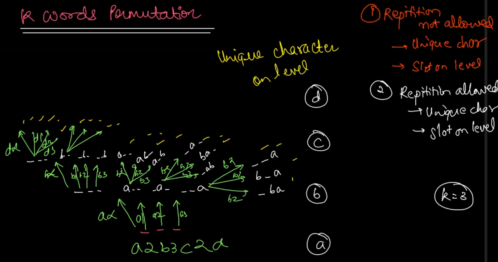

# K words Permutation Repitition not Allowed - 1


# K words Permutation Repitition not Allowed - 2


# Coin change Combinations sum-2 Finite Supply


# coin change | Combinations sum 1 Infinite supply


# 2d Combinations - 1 (Box on Level)


# 2d Combination - 2 using 1d conecpt


### Corrections and Explanations

1. **Parameters:**
   - `qpsf`: Queens placed so far.
   - `tq`: Total queens (or total cells, since every cell can be occupied by 'q' or '-').
   - `cellNo`: The current cell number being processed.
   - `mat`: The string that stores the current configuration of the board.

2. **Logic:**
   - The base case checks if `cellNo` equals `tq * tq`. This condition checks if we've processed all cells in the board. If `qpsf` equals `tq`, it means we've placed queens in all cells. The code prints the current configuration `mat`.

   - The next `if` statement checks if the current cell is the last in its row using the condition `cellNo % tq == tq - 1`. If true, it means we need to move to the next row. The recursion calls in this block:
     - `queensCombinations(qpsf + 1, tq, cellNo + 1, mat + 'q' + '\n');` places a 'q' and moves to the next cell.
     - `queensCombinations(qpsf, tq, cellNo + 1, mat + '-' + '\n');` places a '-' and moves to the next cell.

   - The `else` block handles the case where we're not at the end of the row:
     - `queensCombinations(qpsf + 1, tq, cellNo + 1, mat + 'q');` places a 'q' without adding a newline.
     - `queensCombinations(qpsf, tq, cellNo + 1, mat + '-');` places a '-' without adding a newline.

3. **Code Snippet:**
   ```java
   import java.io.*;
   import java.util.*;

   public class Main {
       public static void queensCombinations(int qpsf, int tq, int cellNo, String mat) {
           if (cellNo == tq * tq) {
               if (qpsf == tq) {
                   System.out.println(mat);
               }
               return;
           }

           if (cellNo % tq == tq - 1) {
               queensCombinations(qpsf + 1, tq, cellNo + 1, mat + 'q' + '\n'); // yes
               queensCombinations(qpsf, tq, cellNo + 1, mat + '-' + '\n');     // no
           } else {
               queensCombinations(qpsf + 1, tq, cellNo + 1, mat + 'q'); // yes
               queensCombinations(qpsf, tq, cellNo + 1, mat + '-');     // no
           }
       }

       public static void main(String[] args) throws Exception {
           BufferedReader br = new BufferedReader(new InputStreamReader(System.in));
           int n = Integer.parseInt(br.readLine());

           queensCombinations(0, n, 0, "");
       }
   }
   ```

### Notes:
- The code reads `n` as the size of the board and `tq` as the total number of cells on the board (`n * n`).
- This setup allows the generation of all possible configurations of 'q' and '-' on an `n x n` board.
- It seems like the `qpsf` is used more for counting the cells processed rather than tracking the number of queens placed. The board configurations are simply about filling cells with either 'q' or '-'.

The logic behind using a single `cellNo` parameter instead of separate `row` and `column` parameters is to simplify the traversal of the 2D board in a 1D manner. Here's how these conditions work:

### `cellNo` Concept
In a traditional 2D array or matrix traversal, you have two indices: `row` and `column`. However, you can linearize these indices into a single index `cellNo` by considering the 2D grid as a flattened 1D array. This approach helps in iterating over the board cells in a straightforward manner, and it can also simplify recursive function calls.

### `cellNo == tq * tq`
- **Condition:** This checks if all the cells in the `n x n` board have been processed.
- **Explanation:** If `tq` represents the number of rows or columns (i.e., the size of the board), then the total number of cells in the board is `tq * tq` (since the board is `tq` rows by `tq` columns). When `cellNo` reaches this value, it means we have processed all the cells, and the recursion should stop.

### `cellNo % tq == tq - 1`
- **Condition:** This checks if the current `cellNo` corresponds to the last column of a row in the 2D grid.
- **Explanation:** In a flattened 1D view of the board, the last column in any row will have a `cellNo` that, when divided by `tq`, leaves a remainder of `tq - 1`. For example, if `tq` is 4 (for a 4x4 board), then the last column in each row will have `cellNo` values of 3, 7, 11, 15 (i.e., `tq - 1`, `2*tq - 1`, `3*tq - 1`, etc.). The condition `cellNo % tq == tq - 1` captures these cases, indicating that the next recursive call should start a new line (row) in the `mat` string representation of the board.

### Advantages of This Approach
1. **Simplicity:** Using a single `cellNo` reduces the number of parameters and makes the recursive calls simpler.
2. **Clarity:** It avoids the need for manual row and column calculations or increments, as the traversal is handled uniformly by incrementing `cellNo`.
3. **Generalization:** This method is easily adaptable to other grid-based problems where the grid can be flattened into a 1D array.

In summary, this approach linearizes the board traversal, making the implementation more straightforward and avoiding the complexity of managing two separate indices (`row` and `column`). The specific conditions (`cellNo == tq * tq` and `cellNo % tq == tq - 1`) are used to manage the end-of-board and end-of-row scenarios, respectively.


# 2d combinations queen as level (Item as level)


### Concept: "Queen as Level" or "Item as Level"

In this approach, each recursive level corresponds to placing a specific queen (or item). The goal is to place the `qpsf`-th queen on the board, exploring all possible positions for this queen before moving to the next.

### How the Code Implements This Concept

1. **Function Parameters**:
   - `qpsf` (`Queens Placed So Far`): Indicates the current queen being placed.
   - `tq` (`Total Queens`): Total number of queens to place, equal to the size of the board (`n`).
   - `chess`: The chessboard as a 2D array.
   - `lastQueenRow` and `lastQueenCol`: The last placed queen's position. These help to ensure the next queen is not placed before the last one, maintaining an order.

2. **Base Case**:
   - When `qpsf == tq`, all queens have been placed. The board configuration is printed.

3. **Recursive Case**:
   - The function tries to place the current queen (`qpsf`) in all possible positions starting from `lastQueenRow` and `lastQueenCol + 1` in the same row, and then from the next rows.
   - **Same Row Placement**: It starts placing the current queen from `lastQueenCol + 1` in the same row (`lastQueenRow`), ensuring it does not place another queen in the same position or before it in the row.
   - **Next Rows Placement**: After exploring the current row, it moves to the next row (`lastQueenRow + 1`) and iterates through all columns from the beginning (`j = 0`).

4. **Backtracking**:
   - After placing a queen and making the recursive call, the function removes the queen (`chess[i][j] = '-'`) to explore other possible placements.

### Key Advantages of "Queen as Level" Approach

1. **Simplicity**: By treating each queen as a level, the code naturally ensures that each queen is placed exactly once and in a specific order. This reduces the complexity of ensuring all queens are placed.
2. **Ease of Backtracking**: When you backtrack, you only need to undo the placement of the current queen without worrying about other placements.

### Example Walkthrough

For a 2x2 board (`n = 2`), the recursive calls would explore all possible ways to place two queens:

1. **First Queen**:
   - Attempt to place in `(0,0)`, then `(0,1)`.
   - Then move to `(1,0)`, and finally `(1,1)`.

2. **Second Queen**:
   - After placing the first queen, the second queen is placed in all remaining positions, respecting the order determined by `lastQueenRow` and `lastQueenCol`.

The result is that all possible combinations of queen placements are explored, and the function prints each configuration.

This "queen as level" approach is a good technique for problems where you want to explore combinations or placements of distinct items (like queens, knights, or even other types of items) on a grid or board. It ensures that each item is considered individually and placed in all possible valid positions.

Here's your code with detailed comments explaining the logic and steps:

```java
import java.io.BufferedReader;
import java.io.InputStreamReader;

public class _50_2D_Combiantion_QOL_Item_as_level {

    // This method generates all combinations of placing tq queens on an n x n board
    public static void queensCombinations(int qpsf, int tq, Character[][] chess, int lastQueenRow, int lastQueenCol) {
        // Base case: if the number of queens placed so far equals the total number of queens
        if (qpsf == tq) {
            // Print the current configuration of the chess board
            for (int i = 0; i < tq; i++) {
                for (int j = 0; j < tq; j++) {
                    System.out.print(chess[i][j] + "\t");
                }
                System.out.println();
            }
            System.out.println();
            return;
        }

        // Try to place the current queen in the remaining cells of the current row
        for (int j = lastQueenCol + 1; j < tq; j++) {
            if (chess[lastQueenRow][j] == '-') { // Check if the cell is empty
                chess[lastQueenRow][j] = 'q'; // Place the queen
                // Recur to place the next queen
                queensCombinations(qpsf + 1, tq, chess, lastQueenRow, j);
                chess[lastQueenRow][j] = '-'; // Backtrack: remove the queen
            }
        }

        // Try to place the current queen in the cells of the subsequent rows
        for (int i = lastQueenRow + 1; i < tq; i++) {
            for (int j = 0; j < tq; j++) {
                if (chess[i][j] == '-') { // Check if the cell is empty
                    chess[i][j] = 'q'; // Place the queen
                    // Recur to place the next queen
                    queensCombinations(qpsf + 1, tq, chess, i, j);
                    chess[i][j] = '-'; // Backtrack: remove the queen
                }
            }
        }
    }

    public static void main(String[] args) throws Exception {
        BufferedReader br = new BufferedReader(new InputStreamReader(System.in));
        int n = Integer.parseInt(br.readLine()); // Read the board size (n)
        Character[][] chess = new Character[n][n]; // Initialize the chess board
        for (int i = 0; i < n; i++) {
            for (int j = 0; j < n; j++) {
                chess[i][j] = '-'; // Set all cells to empty
            }
        }

        // Start the recursion with no queens placed, on an empty board
        queensCombinations(0, n, chess, 0, -1);
    }
}
```

### Key Points Highlighted in Comments:

1. **Base Case**: The base case checks if the number of queens placed so far (`qpsf`) is equal to the total number of queens (`tq`). If true, it means a valid configuration is found, and the board is printed.

2. **Placing Queens in the Current Row**:
   - The first for-loop attempts to place a queen in the same row as the last placed queen (`lastQueenRow`), starting from the column immediately after `lastQueenCol`.
   - This ensures queens are placed in a non-overlapping manner in the current row.

3. **Placing Queens in Subsequent Rows**:
   - The second set of nested loops attempts to place the next queen in the rows below the last placed queen (`lastQueenRow + 1`), starting from the first column (`j = 0`).
   - This loop covers all possible placements of the current queen in the rows below the last placed queen.

4. **Backtracking**:
   - After placing a queen and making a recursive call to place the next queen, the code removes the queen (`chess[lastQueenRow][lastQueenCol] = '-'`) to explore other configurations. This is known as backtracking.

5. **Initialization and Input**:
   - The `main` method initializes the chessboard with `'-'` (indicating empty cells) and reads the board size `n` from the input. It then starts the recursive process by calling `queensCombinations`.

This code effectively demonstrates how to use recursion and backtracking to explore all possible configurations of placing queens on an `n x n` board, treating each queen as a level in the recursive exploration.

# 2D_Combiantion as 1D Item as Level or Queen as Level

Here's your provided code with added comments to explain the logic and steps, and I've made necessary corrections to ensure the code compiles and functions correctly:

```java
import java.io.BufferedReader;
import java.io.InputStreamReader;

public class Main {

    // Method to generate all combinations of placing tq queens on an n x n chessboard
    public static void queensCombinations(int qpsf, int tq, Character[][] chess, int lastCellNo) {
        // Base case: when the number of queens placed so far equals the total number of queens
        if (qpsf == tq) {
            // Print the current configuration of the chessboard
            for (int i = 0; i < tq; i++) {
                for (int j = 0; j < tq; j++) {
                    System.out.print(chess[i][j] + "\t");
                }
                System.out.println();
            }
            System.out.println();
            return;
        }

        // Try to place the current queen in the remaining cells after lastCellNo
        for (int c = lastCellNo + 1; c < tq * tq; c++) {
            int rowNo = c / tq;  // Calculate the row number
            int colNo = c % tq;  // Calculate the column number
            chess[rowNo][colNo] = 'q';  // Place the queen at the calculated position
            // Recur to place the next queen
            queensCombinations(qpsf + 1, tq, chess, c);
            chess[rowNo][colNo] = '-';  // Backtrack: remove the queen
        }
    }

    public static void main(String[] args) throws Exception {
        BufferedReader br = new BufferedReader(new InputStreamReader(System.in));
        int n = Integer.parseInt(br.readLine());  // Read the board size (n)
        Character[][] chess = new Character[n][n];  // Initialize the chessboard
        for (int i = 0; i < n; i++) {
            for (int j = 0; j < n; j++) {
                chess[i][j] = '-';  // Set all cells to empty
            }
        }

        // Start the recursion with no queens placed, starting from cell number -1
        queensCombinations(0, n, chess, -1);
    }
}
```

### Explanation of Key Points in the Code:

1. **Base Case (Line 8)**:
   - If `qpsf` (Queens Placed So Far) equals `tq` (Total Queens), it indicates that all queens have been placed. The function prints the current configuration of the chessboard.

2. **Main Loop for Placement (Line 19)**:
   - The loop iterates over all possible cell numbers starting from `lastCellNo + 1` up to `tq * tq` (which represents the total number of cells on the board). The variable `c` represents the linearized cell number.

3. **Row and Column Calculation (Lines 20-21)**:
   - `rowNo` and `colNo` are calculated using the linearized cell number `c`. This ensures that the cells are traversed in row-major order.
   - `rowNo = c / tq` calculates the row index by integer division.
   - `colNo = c % tq` calculates the column index using the modulus operator.

4. **Queen Placement and Backtracking (Lines 22-26)**:
   - The queen is placed at the position `(rowNo, colNo)`.
   - The function then recursively calls `queensCombinations` with `qpsf + 1` and the current cell number `c`.
   - After returning from the recursion, the code backtracks by removing the queen from `(rowNo, colNo)`.

5. **Initialization and Input (Lines 29-35)**:
   - The `main` method initializes the chessboard and sets all cells to `'-'` to indicate they are empty.
   - The initial call to `queensCombinations` starts with no queens placed (`qpsf = 0`) and begins the search from an invalid cell number (`-1`), ensuring the first queen is placed in cell `0`.

This approach, using `lastCellNo` and linearized cell numbers, is an efficient way to ensure that queens are placed without revisiting previously considered positions and allows for straightforward backtracking. This method is especially useful in scenarios where the board or grid is large, and a more structured approach is needed to systematically explore all combinations.